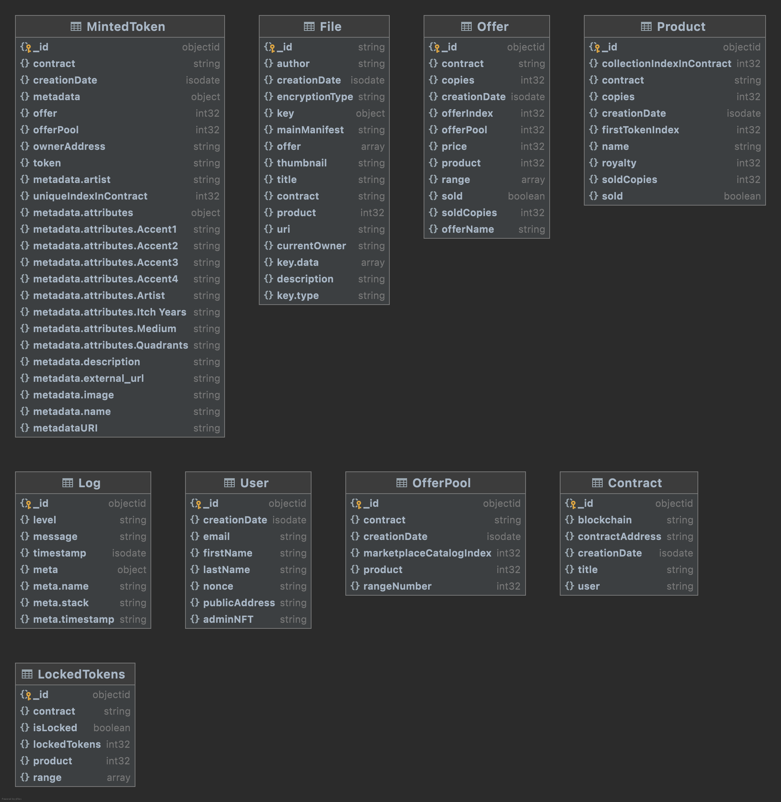

# `decrypt-node`

> TODO: description

## Usage

```
const decryptNode = require('decrypt-node');

// TODO: DEMONSTRATE API
```

# `Docker Implementation -in progress

This will build the rair node, but IPFS will not be functioning locally, as additional configuration is necesary to communicate outside of the container.  This is currently observing an external IPFS cluster, as noted in the .env file.

docker build -t rairnode .

docker run -it --rm -p 5000:5000 -p 3000:3000 -p 5001:5001 -p 4001:4001 -p 8080:8080 rairnode

Optionally, use -d flag to run as a daemon

# Usage of the IPFS Service

For switching between different IPFS services have to be changed environment variable `IPFS_SERVICE`

Supported options:
 - **ipfs** - native IPFS service;
 - **pinata** - Pinata cloud;

# API

* [x] /api
    * [x] /auth
        * [x] /get_challenge/:MetaAddress - GET - request an auth challenge for the given ethereum address, [see details here](readme/get_challenge.md)
        * [x] /get_token/:MetaMessage/:MetaSignature/:mediaId - GET - respond to a challenge to receive a JWT, [see details here](readme/get_token.md)
        * [x] /admin/:MetaMessage/:MetaSignature - GET - verify with a Metamask challenge if the user holds the current Administrator token, [see details here](readme/admin.md)
        * [x] /new_admin/:MetaMessage/:MetaSignature - POST - verify the user holds the current Admin token and then replace it with a new token, [see details here](readme/new_admin.md)
        * [x] /authentication - POST - verification of user signature and generating of JWT token, [see details here](readme/get_jwt_token.md)
        * [x] /user_info - GET - get details about user by JWT token, [see details here](readme/get_user_details.md)
    * [x] /media
        * [x] /add/:mediaId - POST - register a new piece of media, [see details here](readme/add_media.md)
        * [x] /remove/:mediaId - DELETE - find and delete the media, [see details here](readme/remove_media.md)
        * [x] /list - GET - list all the registered media, their URIs and encrypted status, [see details here](readme/get_all_media.md)
        * [x] /upload - POST - upload the media, [see details here](readme/upload_media.md)
    * [x] /users - POST - create new user, [see details here](readme/create_user.md)
        * [x] /:publicAddress - GET - get single user, [see details here](readme/get_user.md)
        * [x] /:publicAddress - PUT - update specific user, [see details here](readme/update_user.md)
    * [x] /contracts - POST - create new contract, [see details here](readme/create_Contract.md)
        * [x] / - GET - get list of contracts for specific user, [see details here](readme/get_contracts.md)
            * [x] /:contractAddress - GET - get specific contract, [see details here](readme/get_single_contract.md)
            * [x] /:contractAddress - DELETE - remove specific contract, [see details here](readme/delete_contract.md)
    * [x] /nft - POST - create new nft tokens, [see details here](readme/bulk_create_NFT_tokens.md)
        * [x] /:contract - 
            * [x] /:product -
                * [x] /files/:token - get files by NFT token, [see details here](readme/get_files_by_nft.md)
    * [x] /products - GET - get all products with all offers for eac of them for particular user, [see details here](readme/get_products.md)
    * [x] /docs - swagger documentation for the server
* [x] /stream/:token/:mediaId - POST - Register a new piece of media, [see details here](readme/stream.md)
* [x] /thumbnails - GET - get static files, [see details here](readme/thumbnails.md)


# MongoDB structure


