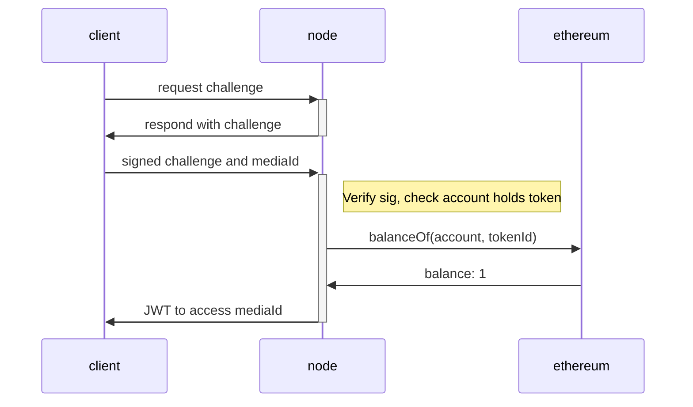

# RAIR Protocol Specification

This document outlines the first draft of the RAIR protocol. The contents of this document should be sufficient to implement a compatible media encoder and decrypt node.

The key words "MUST", "MUST NOT", "REQUIRED", "SHALL", "SHALL NOT", "SHOULD", "SHOULD NOT", "RECOMMENDED",  "MAY", and "OPTIONAL" in this document are to be interpreted as described in RFC 2119.

## Overview

The RAIR protocol is an amalgamation of existing protocols (IPFS, HLS, ERC-1155) which when combined allow for encrypted media (audio and/or video) to be stored on a public distributed storage layer to be viewable only by holders of a blockchain managed ownership token. 

It is comprised of three main compoments:

#### Storage layer - IPFS

The encoded and encrypted media is stored in a distributed way. This eliminates the need for data centers or CDNs and pushes content closer to the edges. Authors of content are responsible for ensuring its availability and pinned status.

#### Decryption Node layer

This component is unique to RAIR. Rather than streaming directly from IPFS a viewer goes through an intermediate node. These trusted nodes hold the decryption keys for certain pieces of media and are incentivised to keep these secret and provide good services to viewers (see section for incentivisation scheme). These nodes MAY also elect to cache local copies of media for faster streaming.

Decryption nodes MUST only provide decryption services to users holding the Ethereum private key to an account which holds at least one viewing token for the given piece of media.

#### Player

While content can be streamed to any HLS compatible player the viewer must first acquire a viewing token by proving their possession of a token holding ethereum account. The RAIR web-based media player includes performing this authentication by default as well as adaptive bitrate adjustment.

## Encoding compatible media

Media to be made available through RAIR MUST be encoded using the [HTTP Live Streaming (HLS)](https://tools.ietf.org/html/rfc8216) format. The resulting directory to be uploaded to IPFS MUST contain a main manifest file (.m3u8) and optionally additional sub-manifests. The media content SHOULD be split into small chunk files (.ts) which MAY optionally be in subdirectories.

The root directory MUST contain a file named `rair.json`. See section for required schema for this file.

A simple example of a directory structure to upload
```
my_video
├── rair.json
├── master.m3u8
├── segment_00000.ts
├── segment_00001.ts
├── segment_00002.ts
```

A more complex example with subtitles and subdirectories. Each subdirectory contains segments encoded to the given bitrate. This allows adaptive quality adjustment as per the HLS specification.

```
sintel
├── rair.json
├── main.m3u8
├── playlist.m3u8
├── subtitles_en.m3u8
├── subtitles_en.vtt
├── audio
│   ├── stereo
│   │   ├── en
│   │   │   └── 128kbit
│   │   └── none
│   │       └── 128kbit
│   └── surround
│       └── en
│           └── 320kbit
└── video
    ├── 10000kbit
    ├── 1100kbit
    ├── 1500kbit
    ├── 250kbit
    ├── 4000kbit
    ├── 500kbit
    ├── 6000kbit
    └── 800kbit
```

### Encryption

Media MAY be encrypted before storage on IPFS. It is highly recommended that content be encrypted to protect the value of holding a viewing token however it is not strictly required by the protocol itself.

Encryption, if used, MUST be performed using AES-128 in Cipher Block Chaining (CBC) mode. Only the media chunk files (.ts) SHALL be encrypted.

The Initialization Vector (IV) for the CBC algorithm for each chunk SHALL be the segment number encoded as an unsigned integer padded to 16 bytes little-endian.


### rair.json

For a HLS stream to be supported by RAIR the root directory on IPFS MUST contain a rair.json file. This contains metadata for the decrypt node, notable the address of the NFT contract. It MUST match the following schema:

```javascript
{
  type: 'object',
  properties: {
    name: {type: 'string'},
    author: {type: 'string'},
    description: {type: 'string'},
    nftIdentifier: {
        type: 'string',
        description: 'The identifier for NFT required to stream this content. In the form <contractAddr>:<tokenIndex>'
    },
    encryption: {
      type: 'string',
      enum: ['aes-128-cbc', 'none']
    },
    mainManifest: {
        type: 'string',
        description: 'The name of the main manifest file in the root directory. E.g. master.m3u8.'
    }
  },
  required: ['name', 'nftIdentifier', 'encryption', 'mainManifest']
}
```

## Decrypt Node

A decrypt node provides a standard public API to which a RAIR player can connect, authenticate and stream from.

To get access to a stream the following protocol is followed:

- A potential client sends their ethereum public key and requests a challenge
- The node responds with a securely randomly generated challenge string
- The client signs the challenge using their ethereum private key and then responds with the original challenge, signature and mediaID of the content they wish to get access to
- The node verifies the client indeed holds the private key for the provided public key and then (if the media requires it) checks the Ethereum blockchain to ensure the account posesses the required viewing token
- If accepted the node responds with a JWT which grants the holder access to the given media stream for a duration. The JWT must be included in all requests to stream the requested media.



A decrypt node MUST implement the following HTTP methods on its public interface.

#### GET `/api/auth/get_challenge/:eth_address`

Given a valid Ethereum public key (base64 encoded) returns a cryptographically random challenge string

#### GET `/api/auth/get_token/:challenge/:signature/:media_id`

Given a challenge string, signed challenge and mediaId returns a JWT. This JWT has been signed by the node with its secret and cannot be modified by another party (like a normal JWT).

The JWT has the following fields:
- eth_addr - The Base64 encoded ethereum public key
- media_id - The media identifier string this grants access to

#### GET `/stream/:token/:media_id/[path/to/file]`

This is how restricted media is accessed. 

Token is a JWT issued by this node which has mediaId equal to the given mediaId on the path

media_id is the identifier for some piece of media this node holds the decryption keys to.

The remainder of the path specifies the file path to the file the client is requesting in the IPFS directory

## Non-Fungible Tokens

The decrypt node will check that the calling account owns at least one viewing NFT before returning a JWT. It does this by retrieving the `ntfIdentifier` from the `rair.json` and then making a call to a trusted Ethereum node to verify the balance. This is done by calling `balanceOf(<account>, <tokenId>)` on the contract speficied in the first part of the nftIdentifier. If this returns a value greater than zero then the node will approve access. 

## RAIR Player

Once a JWT has been obtained it is possible to stream content from a decrypt node to any player that supports HLS (e.g. VLC, KODI, hls.js web player). A RAIR player with access to the users Ethereum keys can make this process much more streamlined by automating the challenge/response handshake and caching a JWT. 

